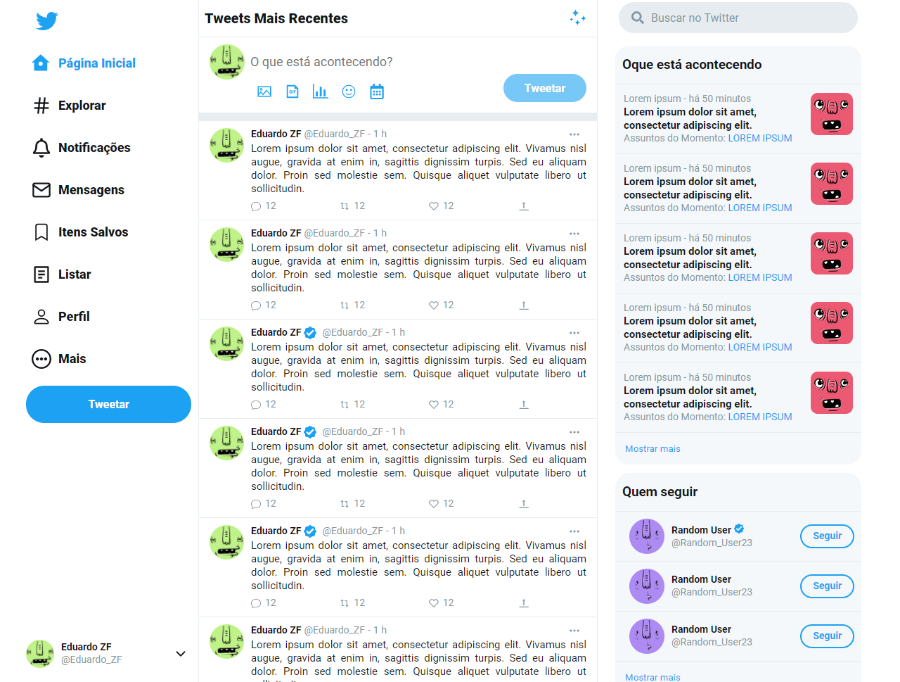

<!-- PROJECT SHIELDS -->
[![Contributors][contributors-shield]][contributors-url]
[![Forks][forks-shield]][forks-url]
[![Stargazers][stars-shield]][stars-url]
[![Issues][issues-shield]][issues-url]
[![MIT License][license-shield]][license-url]

<!-- PROJECT LOGO -->
<br />
<p align="center">
  <a href="https://github.com/eduardozf/Twitter">
    
  </a>

  <h3 align="center">Twitter</h3>

  <p align="center">
    Um projeto para estudos!
    <br />
    <a href="https://eduardozf.github.io/">Ver demo</a>
    ·
    <a href="https://github.com/eduardozf/Twitter/issues">Reportar Bug</a>
  </p>
</p>


<!-- TABLE OF CONTENTS -->
## Sumário

📌 [Sobre o projeto](#sobre-o-projeto)<br />
📌 [Tecnologias utilizadas](#tecnologias-utilizadas)<br />
📌 [Iniciando](#iniciando)<br />
📌 [Pré-requisitos](#pré-requisitos) <br />
📌 [Instalação](#instalação)<br />
📌 [Licença](#licença)<br />
📌 [Contato](#contato)<br />
📌 [Agradecimentos](#agradecimentos)<br />


<!-- ABOUT THE PROJECT -->
## Sobre o projeto
<p align="left">
  
  
</p>


💡 Estou começando agora no desenvolvimento com o react e node, para treinar resolvi recriar algumas funcionalidade do Twitter.

### Tecnologias utilizadas
* [React](https://reactjs.org/)
* [Node](https://nodejs.org/en)
* [Typescript](https://www.typescriptlang.org/)
* [Express](https://expressjs.com/)
* [Axios](https://www.axios.com/)
##### Mobile
* [React-Native](https://reactnative.dev/)
* [React-Navigation](https://reactnavigation.org/)
* [React-Native Vector Icons](https://github.com/oblador/react-native-vector-icons)
* [Axios](https://www.axios.com/)
* [Unform](https://github.com/Rocketseat/unform)

<!-- GETTING STARTED -->
## Iniciando

Para iniciar o projeto localmente você precisará seguir algumas instruções.

### Pré-requisitos
* NodeJS
* Yarn ou Npm

### Instalação

```sh
# Clone o repositório
git clone https://github.com/eduardozf/Twitter.git

1. Criar instancia postgres-sql
2. Criar database twitter

# Path ./back-end/
3. Instalar pacotes
# Yarn
yarn
# Npm
npm install

# Path ./back-end/ormconfig.json
4. Alterar Porta/Usuário/Senha do typeorm conforme o banco criado acima

5. Implementar migration no banco
yarn typeorm migration:run

# Entrar na pasta do projeto web
cd web/

# Instale todos os pacotes
# Yarn
yarn
# Npm
npm install

# Ambiente de desenvolvimento

## Back-end
yarn dev
## Web
yarn start
```

<!-- LICENSE -->
## Licença
Distribuído sob a licença MIT. Veja `LICENSE` para mais informações.

<!-- CONTACT -->
## Contato

Eduardo Zotelli Ferraz - eduardozf1@gmail.com

🔗 Link do projeto: [Twitter](https://github.com/eduardozf/Twitter)
<br />
🔗 Link da demonstração: [Demo](https://eduardozf.github.io/)


<!-- ACKNOWLEDGEMENTS -->
## Agradecimentos
* [IMG Shields](https://shields.io)
* [Best README Template](https://github.com/othneildrew/Best-README-Template)

<!-- MARKDOWN LINKS & IMAGES -->
[contributors-shield]: https://img.shields.io/github/contributors/eduardozf/Twitter.svg?style=flat-square
[contributors-url]: https://github.com/eduardozf/Twitter/graphs/contributors
[forks-shield]: https://img.shields.io/github/forks/eduardozf/Twitter.svg?style=flat-square
[forks-url]: https://github.com/eduardozf/Twitter/network/members
[stars-shield]: https://img.shields.io/github/stars/eduardozf/Twitter.svg?style=flat-square
[stars-url]: https://github.com/eduardozf/Twitter/stargazers
[issues-shield]: https://img.shields.io/github/issues/eduardozf/Twitter.svg?style=flat-square
[issues-url]: https://github.com/eduardozf/Twitter/issues
[license-shield]: https://img.shields.io/github/license/eduardozf/Twitter.svg?style=flat-square
[license-url]: https://github.com/eduardozf/Twitter/blob/main/LICENSE.txt
[product-screenshot]: images/MainPage.png
[product-gif]: images/app.gif
